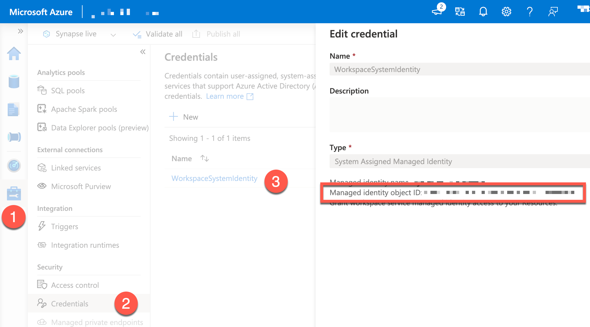

# Sample-SynapsePipelineS3SecretsManager

This sample shows how Azure Synapse can use its managed identity to retrieve S3 keys from AWS Secrets Manager.

The sample is based in part on [Access AWS resources using Azure AD Managed Identity](https://blog.identitydigest.com/azuread-access-aws/).

## Why

Azure Synapse pipelines access S3 buckets using a key that is normally stored either as part of the configuration of the pipeline, or in Azure Key Vault (the preferred solution).

When the key in stored in AWS Secrets Manager (e.g. to manage key rotation) it must first be copied to Azure and then kept up to date in order for Synapse to use it. This adds complexity due to the introduction of a key replication mechanism, and is subject to potential stale keys if the replication does not happen frequently enough.

The solution shows how Synapse can use its managed identity to access an S3 bucket reading keys directly from Secrets Manager, avoiding the need of a replication mechanism.

## Architecture

The solution relies on a proxy Azure Function to retrieve the key from Secrets Manager.


### Call sequence diagram


## Setup

### Create and Azure Function App with Azure AD Authentication Provider

Create and Azure Function App. For this sample, select Python runtime version 3.9, and Consumption plan.

Enable built-in authentication via Azure AD.
See [Authentication and authorization in Azure App Service and Azure Functions](https://learn.microsoft.com/en-us/azure/app-service/overview-authentication-authorization).

Take note of the Application ID (Client ID) assigned to the Function App; it will be used as the "audience" value to map Azure AD tokens to the IAM role in AWS.


### Take note of the Azure AD tenant ID

Take note of the Azure AD tenant ID; it is required to setup federation in IAM.


### Take note of the Azure Synapse identity object ID

Take note of the object ID of the Synapse workspace managed identity.
The object ID is required to map the IAM role uniquely to tokens generated by Synapse.



### Create the IAM OpenID Connect identity provider

To setup the federation in IAM you must create an OpenID Connect identity provider.

After creation, take note the of the provider ARN; it is necessary for the role mapping.

To create the provider you need:

- **Provider URL** - in the form `https://sts.windows.net/<Azure AD tenant ID>/`, where `<Azure AD tenant ID>` must be replaced with the ID of the Azure AD tenant. **Important:** the URL must end with a slash.
- **Audience** - the Application ID of the Function App.


For further details on the procedure to create an OpenID identity provider, please refer to [Creating OpenID Connect (OIDC) identity providers](https://docs.aws.amazon.com/IAM/latest/UserGuide/id_roles_providers_create_oidc.html).

### Create a IAM role

Create a IAM role with a custom trust policy.

For details about the process, please see [Creating a role using custom trust policies (console)](https://docs.aws.amazon.com/IAM/latest/UserGuide/id_roles_create_for-custom.html).

The trust policy must look like the following.

```json
{
    "Version": "2012-10-17",
    "Statement": [
        {
            "Effect": "Allow",
            "Principal": {
                "Federated": "<OpenID Connect identity provider ARN>"
            },
            "Action": "sts:AssumeRoleWithWebIdentity",
            "Condition": {
                "StringEquals": {
                    "sts.windows.net/<Azure AD tenant ID>/:sub": "<Synapse managed identity object ID>",
                    "sts.windows.net/<Azure AD tenant ID>/:aud": "<Function App Application ID>"
                }
            }
        }
    ]
}
```

Replace the placeholders as follows.

| Placeholder                              | Replace with                                         |
|------------------------------------------|------------------------------------------------------|
| `<OpenID Connect identity provider ARN>` | The ARN of the Open ID identity provider.            |
| `<Azure AD tenant ID>`                   | The ID of the Azure AD tenant.                       |
| `<Synapse managed identity object ID>`   | Object ID of the Synapse managed identity.           |
| `<Function App Application ID>`                   | The application ID associated with the Function App. |

The policy associates the IAM role to any Azure AD token requested specifically by Synapse (identified by the "sub" property) to access the Function App (identified by "aud"). If another principal requests a token for the Function App, the "sub" property would be different and the token could not be used to assume the IAM role. Proper use of the "sub" property is critical to control which Azure AD principal can assume the IAM role. If the condition on the "sub" property is omitted, any Azure AD principal that can acquire a token for the Function App can also assume the IAM role.

### Assign permissions to the role

Assign permissions to the IAM role to read information from Secrets Manager; the details are beyond the scope of this sample.

### Deploy the sample Azure Function

Deploy the sample Azure Function from the `Function` folder.

For details on how to deploy a function, please see [Deployment technologies in Azure Functions](https://learn.microsoft.com/en-us/azure/azure-functions/functions-deployment-technologies).

### Create a Synapse linked service to S3

Create a new linked service pointint to S3 inside the Synapse workspace.

Since the S3 key is retrieved at runtime from Secrets Manager, the Synapse linked service must replace the key and the key ID with parameters, so that their value can be set after it is retrieved from Secrets Manager.

The linked service is defined as follows.

```json
{
    "name": "S3",
    "type": "Microsoft.Synapse/workspaces/linkedservices",
    "properties": {
        "parameters": {
            "s3accesskeyid": {
                "type": "String"
            },
            "s3accesskeysecret": {
                "type": "string"
            }
        },
        "annotations": [],
        "type": "AmazonS3",
        "typeProperties": {
            "serviceUrl": "https://s3.amazonaws.com",
            "accessKeyId": "@{linkedService().s3accesskeyid}",
            "secretAccessKey": "@{linkedService().s3accesskeysecret}",
            "authenticationType": "AccessKey"
        },
        "connectVia": {
            "referenceName": "AutoResolveIntegrationRuntime",
            "type": "IntegrationRuntimeReference"
        }
    }
}
```

Note that accessKeyID and secretAccessKey have been replaced by expressions referencing the linked service parameters.


### Create a dataset

Create a dataset representing data in S3.

The dataset must have parameters for the key and a key ID, that must be passed on to the S3 linked service.

The definition of the sample binary dataset is as follow.

```json
{
    "name": "S3Source",
    "properties": {
        "linkedServiceName": {
            "referenceName": "S3",
            "type": "LinkedServiceReference",
            "parameters": {
                "s3accesskeyid": {
                    "value": "@dataset().s3accesskeyid",
                    "type": "Expression"
                },
                "s3accesskeysecret": {
                    "value": "@dataset().s3accesskeysecret",
                    "type": "Expression"
                }
            }
        },
        "parameters": {
            "s3accesskeyid": {
                "type": "string",
                "defaultValue": "none"
            },
            "s3accesskeysecret": {
                "type": "string",
                "defaultValue": "none"
            }
        },
        "annotations": [],
        "type": "Binary",
        "typeProperties": {
            "location": {
                "type": "AmazonS3Location",
                "bucketName": "<Bucket name>",
                "folderPath": "<Folder path>"
            }
        }
    },
    "type": "Microsoft.Synapse/workspaces/datasets"
}
```

Replace the placeholders as follows.

| Placeholder     | Replace with              |
|-----------------|---------------------------|
| `<Bucket name>` | Name of the S3 bucket     |
| `<Folder path>` | Path inside the S3 bucket |

### Create a Synapse pipeline

Create a new Synapse pipeline

#### Web activity

Add a web activity to retrieve the S3 access key.

The definition of the activity is as follows.

```json
{
    "name": "Get S3 Access Key",
    "type": "WebActivity",
    "dependsOn": [],
    "policy": {
        "timeout": "0.12:00:00",
        "retry": 0,
        "retryIntervalInSeconds": 30,
        "secureOutput": false,
        "secureInput": false
    },
    "userProperties": [],
    "typeProperties": {
        "url": "https://<Function App URL>/api/HttpTrigger1?role_arn=<IAM role ARN>&secret_name=<Secret name>&region=<Secrets Manager region>",
        "connectVia": {
            "referenceName": "AutoResolveIntegrationRuntime",
            "type": "IntegrationRuntimeReference"
        },
        "method": "GET",
        "authentication": {
            "type": "MSI",
            "resource": "<Application ID>"
        }
    }
}
```

Replace the placeholders as follows.

| Placeholder                | Replace with                                                                 |
|----------------------------|------------------------------------------------------------------------------|
| `<Function App URL>`       | The URL of the Azure Function App.                                           |
| `<IAM role ARN>`           | The ARN of the IAM role to access Secrets Manager. |
| `<Secret name>`            | Name of the secret to retrieve.                                              |
| `<Secrets Manager region>` | Region of Secrets Manager                                                    |
| `<Application ID>`         | Application ID of the Function App                                           |


#### Copy activity

Create a copy activity using the S3 source dataset as source, and another arbitrary dataset as sink.

The copy activity must pass the key details, retrieved by the web activity, to the S3 dataset parameters.

The web activity returns a JSON value that contains key ID and key secret.
The two values can be retrieved respectively with these pipeline expressions:

- Key ID: `@activity('Get S3 Access Key').output.access_key_id`
- Key secret: `@activity('Get S3 Access Key').output.access_key_secret`

The definition of the copy activity is as follows.

```json
{
    "name": "Copy S3 data",
    "type": "Copy",
    "dependsOn": [
        {
            "activity": "Get S3 Access Key",
            "dependencyConditions": [
                "Succeeded"
            ]
        }
    ],
    "policy": {
        "timeout": "0.12:00:00",
        "retry": 0,
        "retryIntervalInSeconds": 30,
        "secureOutput": false,
        "secureInput": false
    },
    "userProperties": [],
    "typeProperties": {
        "source": {
            "type": "BinarySource",
            "storeSettings": {
                "type": "AmazonS3ReadSettings",
                "recursive": true
            },
            "formatSettings": {
                "type": "BinaryReadSettings"
            }
        },
        "sink": {
            "type": "BinarySink",
            "storeSettings": {
                "type": "AzureBlobFSWriteSettings"
            }
        },
        "enableStaging": false
    },
    "inputs": [
        {
            "referenceName": "S3Source",
            "type": "DatasetReference",
            "parameters": {
                "s3accesskeyid": "@activity('Get S3 Access Key').output.access_key_id",
                "s3accesskeysecret": "@activity('Get S3 Access Key').output.access_key_secret"
            }
        }
    ],
    "outputs": [
        {
            "referenceName": "BlobDestination",
            "type": "DatasetReference"
        }
    ]
}
```
